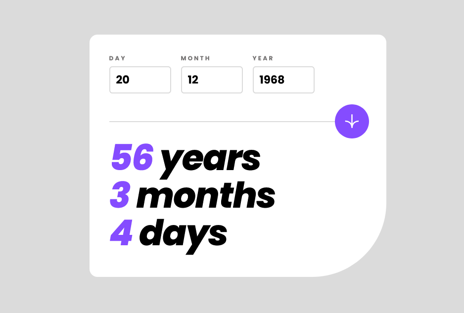
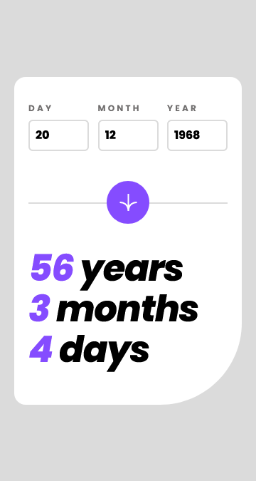

# Frontend Mentor - Age calculator app solution

This is a solution to the [Age calculator app challenge on Frontend Mentor](https://www.frontendmentor.io/challenges/age-calculator-app-dF9DFFpj-Q). Frontend Mentor challenges help you improve your coding skills by building realistic projects.

## Table of contents

- [Overview](#overview)
  - [The challenge](#the-challenge)
  - [Screenshot](#screenshot)
  - [Links](#links)
- [My process](#my-process)
  - [Built with](#built-with)
  - [Continued development](#continued-development)
- [Author](#author)

## Overview

### The challenge

Users should be able to:

- View an age in years, months, and days after submitting a valid date through the form
- Receive validation errors if:
  - Any field is empty when the form is submitted
  - The day number is not between 1-31
  - The month number is not between 1-12
  - The year is in the future
  - The date is invalid e.g. 31/04/1991 (there are 30 days in April)
- View the optimal layout for the interface depending on their device's screen size
- See hover and focus states for all interactive elements on the page
- **Bonus**: See the age numbers animate to their final number when the form is submitted

### Screenshot

### Links

- Solution URL: [https://github.com/jayAEY/age-calculator](https://github.com/jayAEY/age-calculator)
- Live Site URL: [https://jayaey.github.io/age-calculator/](https://jayaey.github.io/age-calculator/)

## My process

### Built with

- Semantic HTML5 markup
- CSS custom properties
- Flexbox
- Mobile-first workflow
- [React](https://reactjs.org/) - JS library
- [TailwindCSS](https://nextjs.org/) - CSS framework
- [Vite](https://vitejs.dev/) - Frontend Build Tool

### Continued development

This project took a lot longer than I expected. At first, I thought it would be a fairly straightforward way to practice styling with tailwind. It turns out, things like handling dates, creating custom error messages and creating functions to handle validity were a lot of work. Thankfully, the animation was easier than I expected.

## Author

- Frontend Mentor - [@jayAEY](https://www.frontendmentor.io/profile/jayAEY)
